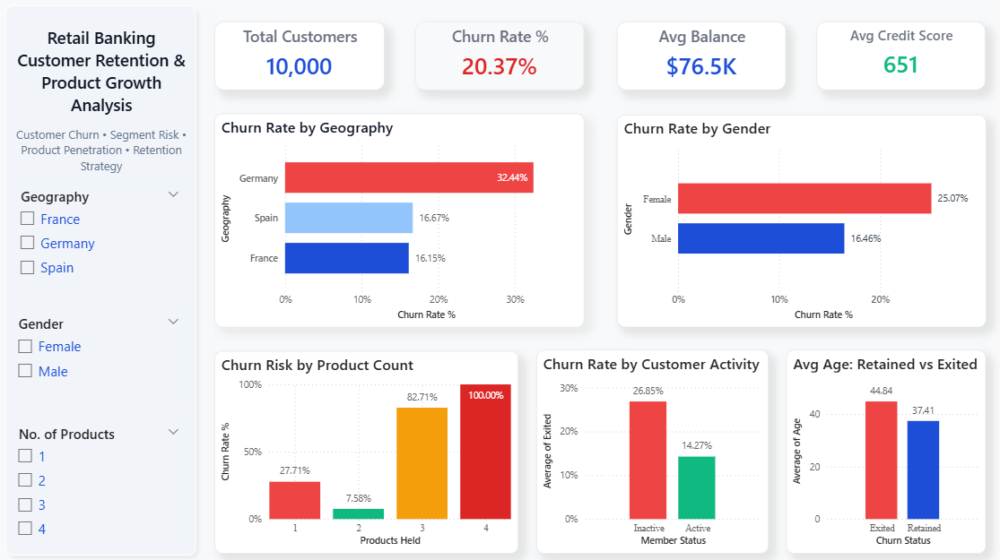

# Retail Banking Customer Retention & Product Growth Analysis

## Project Overview

This project analyzes retail banking customer data to identify churn drivers, customer retention opportunities, and product growth strategies using Power BI and Python.

The objective was to help a retail bank understand why customers leave, which segments are most at risk, and how product ownership and engagement influence long-term retention.

The dashboard was designed as an executive decision-making tool focused on customer churn, segmentation, and growth opportunities.

---

## Business Objectives

The analysis focused on answering the following questions:

- What percentage of customers are leaving the bank?
- Which regions have the highest churn rate?
- Does churn differ by gender or age group?
- How does customer activity affect retention?
- How does number of products impact churn?
- Which customer segments require targeted retention strategies?

---

## Dataset

**Source:** Bank Customer Churn Dataset

The dataset contains **10,000 retail banking customers** with attributes such as:

- Geography
- Gender
- Age
- Credit Score
- Balance
- Number of Products
- Active Membership Status
- Credit Card Ownership
- Estimated Salary
- Churn Status (Exited / Retained)

---

## Tools Used

- Power BI
- Python
- Pandas
- Data Analysis
- Data Visualization

---

## Skills Demonstrated

- KPI Reporting
- Churn Analysis
- Customer Segmentation
- Business Intelligence
- Dashboard Design
- Executive Reporting
- Insight Generation

---

## Dashboard KPIs

| KPI | Value |
|-----|------|
| Total Customers | 10,000 |
| Churn Rate | 20.37% |
| Average Balance | $76.5K |
| Average Credit Score | 651 |

---

## Key Insights

### Customer Churn

- Overall churn rate was **20.37%**, meaning approximately 1 in 5 customers left the bank.

### Regional Risk

- Germany had the highest churn rate at **32.44%**, nearly double France and Spain.

### Gender Trends

- Female customers showed higher churn (**25.07%**) than male customers (**16.46%**).

### Product Ownership Impact

- Customers holding **2 products** had the lowest churn rate (**7.58%**).
- Customers with 1 product showed significantly higher churn (**27.71%**).

### Customer Activity Impact

- Inactive customers had churn of **26.85%** compared to **14.27%** for active members.

### Demographic Trend

- Customers who exited had a higher average age (**44.84**) compared to retained customers (**37.41**).

---

## Dashboard Preview



---

## Business Recommendations

- Launch targeted retention campaigns in Germany.
- Improve engagement programs for inactive customers.
- Cross-sell second products to one-product customers.
- Build personalized retention strategies for older customer segments.
- Review service experience and product fit across customer demographics.

---

## Project Structure

```text
retail-banking-customer-retention-analysis/
│── README.md
│── dashboard.png
│── banking-customer-retention.pbix
│── Bank_Churn.csv
